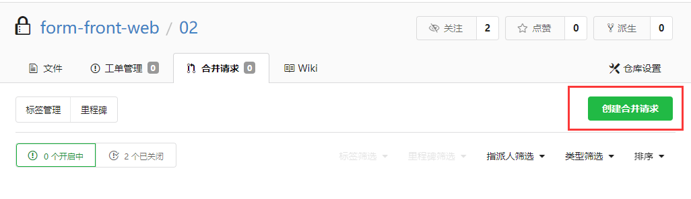
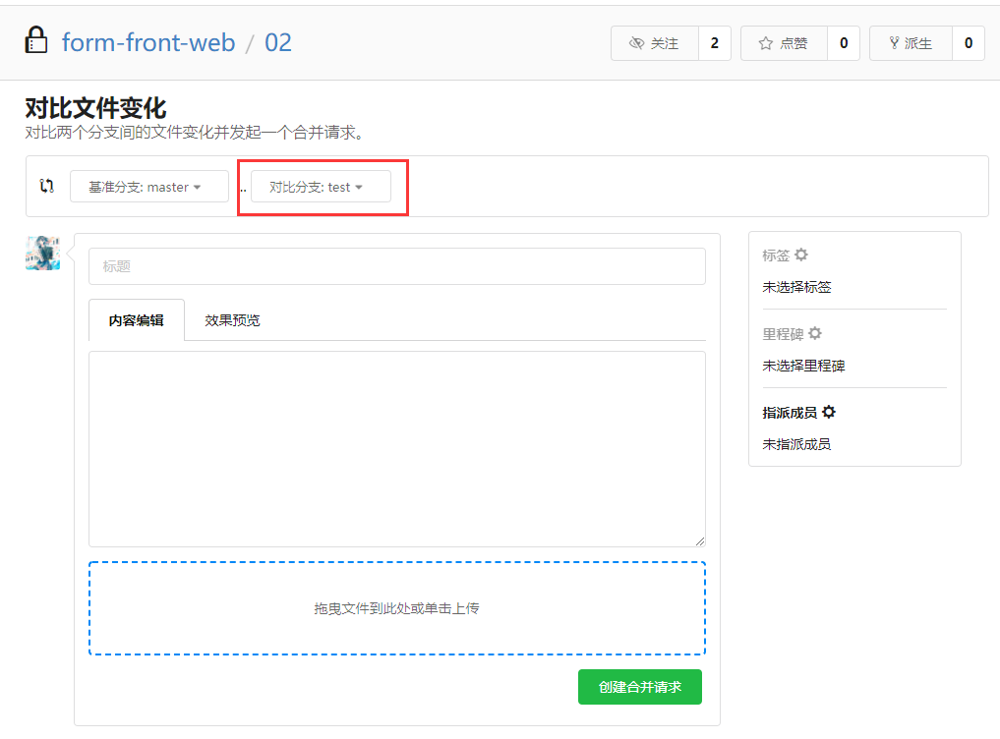
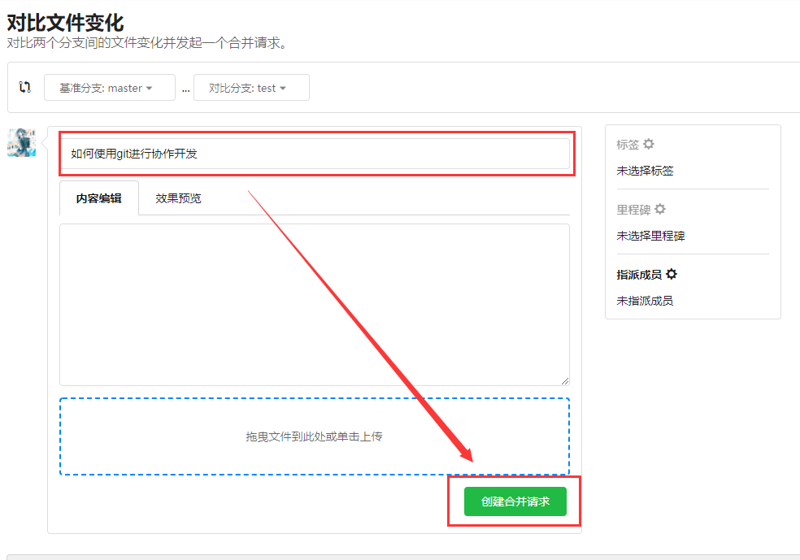
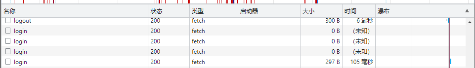

# form-02

## 运行说明

```bash
npm i
npm run serve
```

## 模块划分

### 代码结构(src)

```bash
├─assets
│  ├─image
│  └─styles
├─components
│  ├─formHeader
│  ├─formNav
│  └─problemFilling
├─router
├─services
├─store
├─utils
└─views
    ├─FillForm
    ├─FormProblem
    ├─Home
    ├─Login
    ├─NewForm
    │  └─problemGenerated
    ├─NotFound
    ├─Preview
    ├─Share
    ├─Statistics
    │  └─problemResult
    └─User
```

### 功能划分

- 用户模块（登陆、注册、个人中心页面）  
  注册、登录、退出、设置用户信息、获取用户信息、修改密码

- 表单模块  
  创建表单、填写表单、获取表单填写详情、获取表单单个填写详情、开始收集表单、结束收集表单
  
- 问题模块  
  获取基础题目类型、获取基础题目、收藏、取消收藏、获取收藏列表

- 首页模块  
  获取表单列表、获取表单、删除表单、表单标星、表单取消标星

## 问题与解决方法

### 1. 如何利用git进行协作开发

先把最新的项目代码克隆到本地

```shell
git clone https://git.kscampus.io:10443/form-front-web/02.git
```

我们在本地建立 a 分支，在项目文件夹下执行：

```shell
cd/02
git checkout -b a //分支名称a只是举个例子，不要都用a
```

编写完以后，我们要提交代码到远程的a分支，我们按顺序执行以下代码

```shell
// 将项目的代码变化提交到缓存区（包括修改、添加和删除）
git add -A

// 将缓存区的所有内容提交到当前本地分支，并附上提交说明：'xxx'
git commit -m 'xxx'

// 将代码提交到远程a分支
git push origin a
```

如果a模块已经编写完毕，而且经过测试无bug，那么，我们可以把远程 a 分支合并到远程的 master 分支。

不过，在合并之前，我们需要确认当前的 a 分支是从最新的 master 分支牵出来的。

1. 如果从你克隆项目到本地到你准备合并 a 分支的这个过程中都没有人提交过代码到 master 分支，那么你可以在 Git 上发起 “和并请求” 请求将 a 分支的代码合并到 master 分支。

   

2. 如果从你克隆项目到本地到你准备合并 a 分支的这个过程中有人提交过代码到 master 分支。那么，我们需要先将本地项目切回 master 分支：

```shell
git checkout master
```

将最新的远程 master 分支代码拉到本地的 master 分支：

```shell
git pull origin master
```

切换到本地 a 分支：

```shell
git checkout a
```

将本地 master 分支合并到当前分支：

```shell
git merge master
```

如果合并的过程中有冲突，那么我们可以借助 vscode 去查看冲突的代码并选择我们需要保留的代码。

合并好了以后，我们需要将本地的 a 分支代码更新到远程 a 分支：

```shell
git add -A

git commit -m "xxx"

git push origin a
```

这样远程的 a 分支代码就不会比远程的 master 代码落后了，这样我们就可以提合并请求了。
   

   

**后面就是同意你的合并请求就行了**

### 2. 登录时，偶尔会遇到状态码是200，后端正常响应，却没有响应数据的情况

#### 相关代码

前端代码

api:

```ts
// 登录
export function login(body: Ilogin) {
  return request.post<Ires>("/api/auth/login", body);
}
```

主要代码：

```ts
    const onLogin = async () => {
      if (state.loginbody.account === "") {
        ElMessage.error("请输入用户名");
        return;
      }
      if (state.loginbody.pwd === "") {
        ElMessage.error("请输入密码");
        return;
      }
      const res = await login(state.loginbody);
      if (res.stat === "ok") {
        ElMessage({
          message: "登录成功",
          type: "success",
        });
        store.commit("setUsername", state.loginbody.account);
        router.push("/");
      } else {
        ElMessage.error(res.msg);
      }
    };
```

后端代码

```ts
router.post("/login", checkBody(checkLoginBody), async (ctx: Context) => {
  try {
    const { account, pwd } = ctx.request.body as IRegisterReq;
    const token = await userKit.login(account, pwd);
    ctx.cookies.set("token", token);
    ctx.body = generateOk();
  } catch (err) {
    catchError(err, ctx);
  }
});
```

#### 尝试过哪些方法去解决

分别在前后端进行调试

后端没有抛出错误，正常输出：

```bash
2022/6/5 01:46:13 login success:  stream 123456
path: /api/auth/login
2022/6/5 01:48:26 login success:  admin 123456
path: /api/auth/login
2022/6/5 01:48:33 login success:  admin 123456
path: /api/auth/login
2022/6/5 01:48:39 login success:  admin 123456
```

前端chrome中的请求结果：

可以看到只有第四次登录成功时响应数据才有大小



而且经过测试登陆不成功的时候控制台也没有输出，因此问题可以定位到await这里。

```ts
const res = await login(state.loginbody);
console.log(new Date().toString(), res);//控制台输出
if (res.stat === "ok") {···}
```

初步判断也许是服务端发送了空字符串导致的问题。

后面经过仔细观察发现，提交时页面会有一次刷新，因此换一个角度思考：可能是逻辑部分代码和原来表单的提交有冲突，在前端发送请求等待响应的时候表单提交导致页面已经刷新，因此尝试阻止原生表单的提交事件。

```html
<form onsubmit="return false;">
```

经过多次登录测试，没出现问题了。
